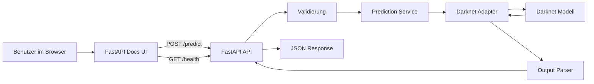

# Waldpilz-Erkennung auf Resthölzern

## Kurzbeschreibung

Dieses Projekt stellt ein trainiertes Bilderkennungsmodell für Pilz- bzw.
Fruchtkörperwachstum auf Resthölzern über eine HTTP-API bereit.

Die erste Release-Version ist bewusst API-first aufgebaut:

- die aktuelle Browser-Oberfläche ist FastAPI `/docs`
- das Backend kapselt HTTP, Validierung und Fehlerbehandlung
- die Modellinferenz wird serverseitig über Darknet ausgeführt

`apps/web/` bleibt vorerst ein Scaffold für eine spätere Iteration und ist nicht
Teil des ersten Releases.

---

## Architektur

Die Architektur trennt klar zwischen API, Fachlogik und technischer
Modellintegration.



Die API stellt aktuell zwei Hauptendpunkte bereit:

- `GET /api/v1/health`
- `POST /api/v1/predict`

---

## Repository-Überblick

```text
forest-fungi-platform/
├─ apps/
│  ├─ api/
│  └─ web/
├─ docs/
├─ models/
├─ ops/
├─ scripts/
└─ README.md
```

- `apps/api/` enthält das FastAPI-Backend
- `apps/web/` ist ein Frontend-Scaffold für eine spätere Iteration
- `docs/` enthält zusätzliche Projekt- und Release-Dokumentation
- `models/` dokumentiert die benötigten Modellartefakte
- `ops/` ist für spätere Betriebs- und Deployment-Hilfen reserviert
- `scripts/` enthält projektweite Hilfsskripte wie die Inferenz-Ausführung

---

## Schnellstart

Für lokale Backend-Einrichtung, API-Verwendung, Konfiguration und Tests:
- siehe [`apps/api/README.md`](apps/api/README.md)

Für Release- und Deployment-Abläufe:
- siehe [`docs/release-guide.md`](docs/release-guide.md)

Für erforderliche Modell-Dateien und deren Ablage:
- siehe [`models/README.md`](models/README.md)

---

## Aktueller Release-Umfang

Der aktuelle Release ist als nutzbare API mit dokumentierter Browser-Oberfläche
über `/docs` gedacht.

Im Fokus stehen:

- ein FastAPI-Backend als stabiler API-Wrapper
- eine gekapselte Darknet-Integration für die Inferenz
- reproduzierbare lokale und containerisierte Ausführung

---

## Zusammenfassung

Das Projekt macht ein bestehendes Modell zur Erkennung von Pilz- bzw.
Fruchtkörperwachstum auf Resthölzern über eine dokumentierte HTTP-API nutzbar.

Die weiterführenden Details sind bewusst aufgeteilt:

- [`apps/api/README.md`](apps/api/README.md) für Backend-Entwicklung und API-Nutzung
- [`docs/release-guide.md`](docs/release-guide.md) für Release und Deployment
- [`models/README.md`](models/README.md) für Modellartefakte
