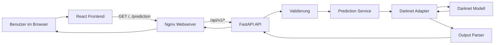

# Waldpilz-Erkennung auf Resthölzern

## Kurzbeschreibung

Dieses Projekt stellt ein trainiertes Bilderkennungsmodell für Pilz- bzw.
Fruchtkörperwachstum auf Resthölzern über eine HTTP-API bereit.

Die aktuelle Release-Version umfasst Backend und Frontend gemeinsam:

- das Frontend unter `apps/web/` stellt die Browser-Oberfläche bereit
- das Backend unter `apps/api/` kapselt HTTP, Validierung und Fehlerbehandlung
- die Modellinferenz wird serverseitig über Darknet ausgeführt
- beide Dienste können gemeinsam per Docker und `make` bereitgestellt werden

---

## Architektur

Die Architektur trennt klar zwischen Frontend, API, Fachlogik und technischer
Modellintegration.



Die API stellt aktuell zwei Hauptendpunkte bereit:

- `GET /api/v1/health`
- `POST /api/v1/predict`

---

## Repository-Überblick

```text
forest-fungi-platform/
├─ apps/
│  ├─ api/
│  └─ web/
├─ docs/
├─ models/
├─ ops/
├─ scripts/
└─ README.md
```

- `apps/api/` enthält das FastAPI-Backend
- `apps/web/` enthält das React-Frontend
- `docs/` enthält zusätzliche Projekt- und Release-Dokumentation
- `models/` dokumentiert die benötigten Modellartefakte
- `ops/` enthält Betriebs- und Deployment-Dateien wie Docker Compose
- `scripts/` enthält projektweite Hilfsskripte wie die Inferenz-Ausführung

---

## Schnellstart

Für lokale Backend-Einrichtung, API-Verwendung, Konfiguration und Tests:
- siehe [`apps/api/README.md`](apps/api/README.md)

Für Frontend-Entwicklung und Frontend-Build:
- siehe [`apps/web/README.md`](apps/web/README.md)

Für Release- und Deployment-Abläufe:
- siehe [`docs/release-guide.md`](docs/release-guide.md)

Für erforderliche Modell-Dateien und deren Ablage:
- siehe [`models/README.md`](models/README.md)

---

## Entwicklungsumgebung einrichten

### 1. Benötigte Software installieren

Für macOS per Homebrew:

```bash
brew install --cask docker-desktop
brew install git python@3.12 node@22 pnpm jq
```

Für Windows mit `winget`:

```powershell
winget install --id Docker.DockerDesktop
winget install --id Git.Git
winget install --id Python.Python.3.12
winget install --id OpenJS.NodeJS
winget install --id pnpm.pnpm
winget install --id jqlang.jq
```

### Bedeutung der Tools

- `docker-desktop` – lokale Container-Umgebung
- `git` – Versionsverwaltung
- `python@3.12` – Python-Version für das Backend
- `node@22` – Node.js für das Frontend
- `pnpm` – Paketmanager für das Frontend / Monorepo
- `jq` – JSON-Auswertung im Terminal

---

## Empfohlene VS Code Extensions

Die folgenden Extensions werden für die Entwicklung empfohlen:

### Pflicht

- `ms-python.python` – Python-Support
- `ms-python.vscode-pylance` – Typprüfung, Autocomplete, Navigation
- `charliermarsh.ruff` – Python-Linting und Formatting
- `dbaeumer.vscode-eslint` – Linting für React / TypeScript
- `esbenp.prettier-vscode` – Formatierung für TypeScript, JSON, Markdown usw.
- `ms-azuretools.vscode-containers` – Docker / Container-Unterstützung
- `eamodio.gitlens` – Git-Historie und Code-Insights
- `humao.rest-client` – API-Requests direkt aus VS Code testen
- `redhat.vscode-yaml` – YAML-Unterstützung für Docker Compose und CI-Dateien


### Extensions installieren

```bash
code --install-extension ms-python.python
code --install-extension ms-python.vscode-pylance
code --install-extension charliermarsh.ruff
code --install-extension dbaeumer.vscode-eslint
code --install-extension esbenp.prettier-vscode
code --install-extension ms-azuretools.vscode-containers
code --install-extension eamodio.gitlens
code --install-extension humao.rest-client
code --install-extension redhat.vscode-yaml
code --install-extension EditorConfig.EditorConfig
```

> Hinweis: Falls der `code`-Befehl noch nicht verfügbar ist, muss er in VS Code einmal aktiviert werden.

---

## Gemeinsames Deployment

Die gesamte Anwendung kann aus dem Repository-Root über die `Makefile` gesteuert werden.
Vor jedem Deployment muessen die Schritte aus [`models/README.md`](models/README.md)
vollstaendig beachtet werden.

Fuer das gemeinsame Docker-Deployment:

```bash
make deploy
```

Danach ist die Anwendung standardmäßig unter `http://localhost:8080` erreichbar.

Wichtige Befehle:

- `make test` – fuehrt lokal alle Backend- und Frontend-Tests sowie Linter aus
- `make backend` – installiert das Backend lokal und startet den lokalen Backend-Server
- `make frontend` – installiert und baut das Frontend lokal und startet den lokalen Preview-Server
- `make dev` – installiert lokal alle Dependencies, baut Frontend und Backend und startet beide lokal
- `make deploy` – baut Backend und Frontend lokal, prueft beide per Healthcheck und deployed sie danach gemeinsam per Docker
- `make ps` – zeigt den Status der Container
- `make logs` – zeigt die Container-Logs
- `make health` – prüft den Health-Endpunkt über das Frontend-Gateway
- `make down` – stoppt den Docker-Stack und entfernt verwaiste Container
- `make clean` – stoppt den Stack und entfernt zugehörige Volumes

Das Frontend spricht im Deployment über denselben Origin mit `/api/v1`, und der
Frontend-Nginx leitet diese Requests intern an das Backend weiter.

---

## Zusammenfassung

Das Projekt macht ein bestehendes Modell zur Erkennung von Pilz- bzw.
Fruchtkörperwachstum auf Resthölzern über eine dokumentierte HTTP-API nutzbar.

Die weiterführenden Details sind bewusst aufgeteilt:

- [`apps/api/README.md`](apps/api/README.md) für Backend-Entwicklung und API-Nutzung
- [`apps/web/README.md`](apps/web/README.md) für Frontend-Entwicklung und Frontend-Build
- [`docs/release-guide.md`](docs/release-guide.md) für Release und Deployment
- [`models/README.md`](models/README.md) für Modellartefakte
