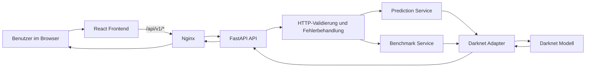

# Waldpilz-Erkennung auf Resthölzern

## Ziel des Projekts

Dieses Repository stellt eine vollständige Anwendung zur Verfügung, mit der ein
trainiertes Darknet-Modell für die Erkennung von Pilz- beziehungsweise
Fruchtkörperwachstum auf Resthölzern genutzt werden kann.

Die Anwendung besteht aus drei zentralen Bausteinen:

- einem React-Frontend unter `apps/web/`
- einer FastAPI unter `apps/api/`
- den benötigten Modellartefakten unter `models/darknet/`

Die Anwendung kann sowohl lokal für die Entwicklung als auch gemeinsam per
Docker Compose betrieben werden.

---

## Für wen diese Dokumentation gedacht ist

Diese Dokumentation ist bewusst so geschrieben, dass auch neue Teammitglieder
ohne tiefe Vorerfahrung mit React, FastAPI, Docker oder Darknet das Projekt
starten können.

Wenn du neu im Projekt bist, ist diese Reihenfolge sinnvoll:

1. Dieses Root-README lesen, um Architektur, Voraussetzungen und den Gesamtfluss zu verstehen.
2. [`apps/api/README.md`](apps/api/README.md) lesen, wenn du das Backend lokal starten oder die API verstehen willst.
3. [`apps/web/README.md`](apps/web/README.md) lesen, wenn du am Frontend arbeitest oder die UI lokal testen willst.
4. [`models/README.md`](models/README.md) lesen, bevor du deployest oder mit Modellartefakten arbeitest.
5. [`docs/release-guide.md`](docs/release-guide.md) lesen, wenn du einen Release vorbereitest oder per Docker deployen willst.

---

## Funktionsumfang der Anwendung

Die aktuelle Anwendung umfasst:

- eine **Startseite** mit Projekteinstieg und Verlinkung zur Bildanalyse
- eine **Prediction-Seite** für die Analyse einzelner Bilder
- eine **Benchmark-Seite** für ZIP-basierte Modellbewertung gegen Ground-Truth-Labels
- einen **PDF-Export** für Benchmark-Reports
- einen **Health Check** über die API und zusätzlich als Aktion im Frontend-Header

Die API stellt aktuell diese Endpunkte bereit:

- `GET /api/v1/health`
- `POST /api/v1/predict`
- `POST /api/v1/benchmark`

Gerade der Benchmark-Endpunkt ist für dieses Projekt wichtig, weil er die
Qualität des Modells gegen einen annotierten Datensatz messbar macht und die
Ergebnisse sowohl im Frontend als auch im exportierten PDF-Report aufbereitet.

---

## Architektur

Die Anwendung trennt Frontend, API, Fachlogik und technische Modellintegration
klar voneinander.



### Was passiert bei einer Prediction?

1. Das Frontend lädt ein einzelnes Bild hoch.
2. Die API validiert Dateityp und Größe.
3. Das Backend ruft `scripts/inference.sh` auf.
4. Das Skript startet Darknet mit den Dateien aus `models/darknet/`.
5. Die Modellantwort wird geparst und als JSON an das Frontend zurückgegeben.
6. Das Frontend zeigt Bounding Boxes, Kennzahlen und Laufzeitinformationen an.

### Was passiert bei einem Benchmark?

1. Das Frontend lädt ein ZIP mit Testbildern und ein ZIP mit YOLO-Labels hoch.
2. Die API validiert beide Archive.
3. Das Backend entpackt die Daten, ordnet Bild und Label anhand des Dateinamens zu und führt die Prediction pro Bild aus.
4. Die Vorhersagen werden gegen die Ground-Truth-Labels verglichen.
5. Das Backend berechnet globale Kennzahlen, labelbezogene Kennzahlen und eine Detailauswertung pro Bild.
6. Das Frontend zeigt die Ergebnisse an und kann daraus einen PDF-Report exportieren.

---

## Repository-Struktur

```text
cnn-fruiting-body-modeling-tp-ss26/
├─ apps/
│  ├─ api/
│  └─ web/
├─ docs/
├─ models/
├─ ops/
├─ scripts/
└─ README.md
```

### Bedeutung der wichtigsten Verzeichnisse

- `apps/api/`
  - FastAPI-Backend
  - API-Endpunkte
  - Fachlogik für Prediction und Benchmark
  - Darknet-Anbindung
- `apps/web/`
  - React-Frontend
  - Seiten für Startseite, Prediction und Benchmark
  - Benchmark-Report-Export im Frontend
- `models/`
  - Darknet-Konfiguration
  - Gewichte
  - `.names`-Datei
  - zusätzliche Modellhinweise
- `ops/`
  - Docker Compose
  - Deploy- und Entwicklungs-Skripte
  - zentrale Shell-Helfer für `make`
- `scripts/`
  - projektweite Skripte wie `inference.sh`

---

## Voraussetzungen für neue Entwickler

### macOS

Empfohlene Installation mit Homebrew:

```bash
brew install --cask docker-desktop
brew install git python@3.12 node@22 pnpm jq
```

### Windows

Empfohlene Installation mit `winget`:

```powershell
winget install --id Docker.DockerDesktop
winget install --id Git.Git
winget install --id Python.Python.3.12
winget install --id OpenJS.NodeJS
winget install --id pnpm.pnpm
winget install --id jqlang.jq
```

### Bedeutung der Tools

- `docker-desktop`
  - notwendig für Container-Builds und das gemeinsame Deployment
- `git`
  - zum Klonen und Aktualisieren des Repositorys
- `python@3.12`
  - Laufzeit für das Backend
- `node@22`
  - Laufzeit für das Frontend
- `pnpm`
  - Paketmanager für das Frontend
- `jq`
  - hilfreich zum Prüfen von JSON-Antworten im Terminal

### Wichtiger Hinweis für Windows

Die `make`-Ziele im Repository rufen Shell-Skripte unter `ops/scripts/*.sh`
auf. Diese Skripte setzen eine POSIX-kompatible Shell voraus.

Darum gilt unter Windows:

- `make deploy`
- `make test`
- `make dev`
- `make backend`
- `make frontend`

sollten über **Git Bash** ausgeführt werden, nicht über die klassische
Eingabeaufforderung und im Zweifel auch nicht über PowerShell.

Wenn du auf Windows arbeitest, öffne also bevorzugt:

```bash
Git Bash
```

und führe die `make`-Kommandos dort aus.

---

## Empfohlene VS Code Extensions

Für ein produktives Onboarding empfehlen sich mindestens diese Extensions:

- `ms-python.python`
- `ms-python.vscode-pylance`
- `charliermarsh.ruff`
- `dbaeumer.vscode-eslint`
- `esbenp.prettier-vscode`
- `ms-azuretools.vscode-containers`
- `eamodio.gitlens`
- `humao.rest-client`
- `redhat.vscode-yaml`
- `EditorConfig.EditorConfig`

Direkt installierbar über:

```bash
code --install-extension ms-python.python
code --install-extension ms-python.vscode-pylance
code --install-extension charliermarsh.ruff
code --install-extension dbaeumer.vscode-eslint
code --install-extension esbenp.prettier-vscode
code --install-extension ms-azuretools.vscode-containers
code --install-extension eamodio.gitlens
code --install-extension humao.rest-client
code --install-extension redhat.vscode-yaml
code --install-extension EditorConfig.EditorConfig
```

---

## Schnellstart für die lokale Entwicklung

Wenn du das Projekt als neuer Entwickler zum ersten Mal ausführst, ist dieser
Ablauf in der Regel der einfachste Einstieg.

### 1. Repository klonen

```bash
git clone <REPOSITORY-URL>
cd cnn-fruiting-body-modeling-tp-ss26
```

### 2. Modellartefakte prüfen

Vor Prediction oder Benchmark müssen die Darknet-Dateien vorhanden sein.
Details stehen in [`models/README.md`](models/README.md).

Mindestens diese Dateien müssen unter `models/darknet/` liegen:

- `Bilderkennung-Pilzwachstum.cfg`
- `Bilderkennung-Pilzwachstum.data`
- `Bilderkennung-Pilzwachstum.names`
- `Bilderkennung-Pilzwachstum_best.weights`

### 3. Lokale Gesamtvalidierung ausführen

```bash
make test
```

Dieses Kommando:

- legt `.env`-Dateien an, falls sie fehlen
- installiert Backend-Abhängigkeiten
- installiert Frontend-Abhängigkeiten
- führt Backend-Lint und Backend-Tests aus
- führt Frontend-Lint und Frontend-Tests aus

### 4. Lokale Entwicklung starten

Wenn du Frontend und Backend gemeinsam lokal starten willst:

```bash
make dev
```

Wenn du nur einen Teil starten willst:

```bash
make backend
make frontend
```

Welche Ports lokal verwendet werden:

- API lokal: `http://127.0.0.1:8000`
- Frontend-Preview lokal: `http://127.0.0.1:4173`
- Frontend-Dev-Server direkt in `apps/web`: `http://localhost:5173`

---

## Root-`Makefile`: Wichtige Kommandos

Die wichtigsten Befehle im Projekt werden bewusst über das Root-`Makefile`
gebündelt, damit neue Entwickler nicht jede Toolchain einzeln zusammensetzen
müssen.

### Lokale Entwicklungsbefehle

- `make test`
  - installiert lokale Abhängigkeiten und führt Backend- sowie Frontend-Prüfungen aus
- `make backend`
  - richtet das Backend lokal ein und startet die API
- `make frontend`
  - richtet das Frontend lokal ein, baut es und startet die Preview
- `make dev`
  - startet Backend und Frontend gemeinsam

### Docker-Betriebsbefehle

- `make deploy`
  - validiert das Docker-Deployment, baut Images und startet den Stack
- `make up`
  - startet den vorhandenen Stack ohne Rebuild
- `make ps`
  - zeigt den Status der Container
- `make logs`
  - zeigt die Logs des Stacks
- `make health`
  - prüft den Health-Endpunkt über das Frontend-Gateway
- `make down`
  - stoppt den Stack
- `make clean`
  - stoppt den Stack und entfernt zusätzlich Volumes

---

## Gemeinsames Docker-Deployment

Für einen vollständigen Anwendungsstart ohne lokale Python- oder Node-Prozesse:

```bash
make deploy
```

Danach ist die Anwendung standardmäßig erreichbar unter:

- `http://127.0.0.1:8080`
- `http://127.0.0.1:8080/api/v1/health`
- `http://127.0.0.1:8080/docs`

### Was `make deploy` im Hintergrund erledigt

1. Prüfung, ob Docker und Docker Compose V2 verfügbar sind
2. Anlegen von `ops/docker/.env`, falls die Datei noch nicht existiert
3. Prüfung, ob die Modellartefakte vorhanden sind
4. Validierung der Compose-Konfiguration
5. Build von Frontend- und Backend-Image
6. Start des Docker-Stacks mit Waiting auf erfolgreiche Healthchecks

### Wichtige Konfigurationsdateien für Docker

- `ops/docker/.env`
  - lokale, nicht versionierte Deployment-Konfiguration
- `ops/docker/.env.example`
  - versionierte Vorlage
- `ops/docker/docker-compose.yaml`
  - Zusammenspiel von Frontend- und Backend-Container

### Aktueller Modellversions-Default im Deployment

Die Docker-Konfiguration verwendet aktuell standardmäßig:

```env
API_MODEL_VERSION=darknet-cnn-v1.1
```

Wenn im Frontend oder in der API eine unerwartete Modellversion angezeigt wird,
sollte zuerst diese Datei geprüft werden:

- `ops/docker/.env`

---

## Weiterführende Dokumentation

### Für Backend-Entwicklung und API-Nutzung

- [`apps/api/README.md`](apps/api/README.md)

Dort findest du:

- lokales Backend-Setup
- API-Endpunkte
- Beispiele für `curl`
- ausführliche Dokumentation des Benchmark-Endpunkts

### Für Frontend-Entwicklung

- [`apps/web/README.md`](apps/web/README.md)

Dort findest du:

- lokale Frontend-Entwicklung
- Routen und UI-Struktur
- Benchmark-UI und Report-Export

### Für Modellartefakte

- [`models/README.md`](models/README.md)

Dort findest du:

- aktive Modellversion
- benötigte Darknet-Dateien
- Hinweise zu `old_model/`
- Details zur `.data`- und `.names`-Datei

### Für Release und Deployment

- [`docs/release-guide.md`](docs/release-guide.md)

Dort findest du:

- Release-Checklisten
- Docker-Release-Flow
- Hinweise für Windows und Git Bash
- fachliche Abnahme für Prediction und Benchmark
