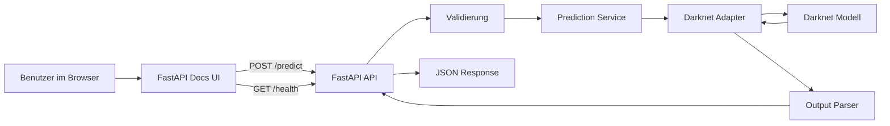

# Waldpilz-Erkennung auf Resthölzern

## Kurzbeschreibung

Dieses Projekt stellt ein bereits trainiertes Bilderkennungsmodell für Pilz- bzw. Fruchtkörperwachstum auf Resthölzern im Forst über eine HTTP-API bereit.

Ziel ist es, Bilder über die API hochladen zu können, die Erkennung auszuführen und die Ergebnisse strukturiert zurückzubekommen. Die Anwendung dient damit als nutzbarer Wrapper um das bestehende Modell und macht die Bilderkennung für Entwicklung, Tests und spätere Nutzung im Betrieb zugänglich.

Der aktuell unterstützte Release-Umfang besteht aus:

- einem **FastAPI-/docs-Frontend** für manuelle Nutzung im Browser
- einem **FastAPI-Backend** als HTTP-Schnittstelle
- einer gekapselten **Darknet-Modellintegration** für die eigentliche Inferenz

`apps/web/` ist bewusst nur ein Scaffold für eine spätere Iteration und nicht
Teil des ersten Releases.

---

## Projektziele

Die Anwendung soll:

- Bild-Uploads entgegennehmen
- die Bilderkennung über das bestehende Modell ausführen
- Ergebnisse konsistent als JSON zurückgeben
- über einen Healthcheck prüfbar sein
- lokal und reproduzierbar per Docker laufen
- für Entwickler gut verständlich und erweiterbar bleiben

---

## Architektur

### Überblick

Die Architektur ist bewusst einfach und robust gehalten:

- **Browser-Oberfläche:** FastAPI `/docs`
- **Backend:** FastAPI
- **Modellintegration:** Darknet wird serverseitig gekapselt aufgerufen
- **Deployment-Ansatz:** Containerisierte Anwendungen mit Docker

Wichtig ist die klare Trennung der Verantwortlichkeiten:

- Die **FastAPI-Dokumentation** dient aktuell als einfache Browser-Oberfläche
  für Healthcheck und Prediction-Requests.
- Das **Backend** kümmert sich um HTTP, Validierung, Fehlerbehandlung und die strukturierte API-Antwort.
- Die **Darknet-Integration** ist im Backend getrennt gekapselt, damit Prozessaufruf, Dateihandling und Parsing nicht in den API-Endpunkten landen.

### Architekturstil

Das Projekt ist als **Monorepo** aufgebaut.  
Frontend und Backend liegen gemeinsam in einem Repository, werden aber als getrennte Anwendungen strukturiert.

Das ist für dieses Projekt sinnvoll, weil:

- Frontend und Backend fachlich eng zusammengehören
- die Entwicklung im Team einfacher bleibt
- Dokumentation, Docker-Setup und Konventionen zentral gepflegt werden können
- die Einstiegshürde für neue Entwickler geringer ist

---

## Kleines Architekturdiagramm



---

## API-Überblick

Die API stellt zwei Hauptendpunkte bereit:

- **`GET /api/v1/health`** – Healthcheck zur Statusprüfung
- **`POST /api/v1/predict`** – Bilderkennung für Fruchtkörper auf Resthölzern

**Beispiel-Response bei Erkennungen:**

```json
{
  "request_id": "db65485c-73f5-478b-b86c-ccef70c62a5f",
  "model_version": "darknet-cnn-v1",
  "detections": [
    {
      "label": "fungus",
      "score": 0.95148888,
      "bbox": { "x": 140, "y": 25, "width": 297, "height": 281 }
    }
  ],
  "inference_time_ms": 787
}
```

Bei fehlenden Erkennungen ist `detections` ein leeres Array.

> **📖 Vollständige API-Dokumentation:** Siehe [`apps/api/README.md`](apps/api/README.md) für:
> - Detaillierte Endpunkt-Beschreibungen mit allen Request/Response-Feldern
> - curl- und Python-Verwendungsbeispiele
> - Fehlerbehandlung und Status-Codes
> - Backend-Setup, Konfiguration und Tests

---

## Repository-Struktur

Die oberste Struktur des Projekts sieht so aus:

```text
forest-fungi-platform/
├─ apps/
│  ├─ web/
│  └─ api/
├─ ops/
├─ models/
├─ README.md
├─ Makefile
└─ .gitignore
```

### Bedeutung der Hauptordner

#### `apps/`
Hier liegen die eigentlichen Anwendungen.

- `apps/web/` → React-Frontend
- `apps/api/` → FastAPI-Backend

#### `ops/`
Betriebsnahe Dateien, z. B.:

- Docker-Compose
- Hilfsskripte
- Umgebungsbeispiele

#### `models/`
Projektlokaler Ablageort fuer Darknet-Modellartefakte.

Standardmaessig wird fuer die Inferenz `models/darknet/` verwendet. Dort werden
folgende Dateien erwartet:

- `Bilderkennung-Pilzwachstum.cfg`
- `Bilderkennung-Pilzwachstum.data`
- `Bilderkennung-Pilzwachstum.names`
- `Bilderkennung-Pilzwachstum_best.weights`

Optional koennen unter `models/darknet/Beispielbilder/` lokale Testbilder liegen.

Diese Modell-Dateien muessen vom Nutzer bzw. Betreiber selbst bereitgestellt
werden. Sie werden nicht als vollstaendiger Bestandteil des Repositories oder
des Release-Prozesses mitgeliefert.

`scripts/inference.sh` verwendet dieses Verzeichnis standardmaessig als
`MODEL_DIR`. Der Darknet-Build wird bevorzugt unter `vendor/darknet/build`
gesucht und faellt ansonsten auf `~/src/darknet/build` zurueck. Beides kann bei
Bedarf ueber `MODEL_DIR`, `DARKNET_DIR`, `DARKNET_DATA_FILE`,
`DARKNET_CFG_FILE` und `DARKNET_WEIGHTS_FILE` ueberschrieben werden.

Wichtig: Grosse Modellgewichte sollten in der Regel **nicht unkontrolliert ins
Git eingecheckt** werden. Die `.gitignore` unter `models/` ignoriert deshalb
standardmaessig grosse lokale Artefakte wie Gewichte, Trainingslisten, Backups
und Beispielbilder, waehrend textbasierte Konfigurationsdateien versionierbar
bleiben.

---

## Detaillierte Repo-Struktur

### Frontend: `apps/web/`

```text
apps/web/
├─ public/
├─ src/
│  ├─ app/
│  ├─ pages/
│  ├─ features/
│  │  └─ prediction/
│  │     ├─ api/
│  │     ├─ components/
│  │     ├─ hooks/
│  │     ├─ model/
│  │     └─ utils/
│  ├─ shared/
│  │  ├─ api/
│  │  ├─ ui/
│  │  ├─ lib/
│  │  ├─ config/
│  │  └─ types/
│  └─ test/
├─ Dockerfile
└─ package.json

```

#### Zweck der Frontend-Struktur

- `app/`  
  Technische Verdrahtung der Anwendung, z. B. Router und Provider.

- `pages/`  
  Seiten der Anwendung, z. B. Startseite.

- `features/prediction/`  
  Alles, was fachlich zur Bilderkennung gehört:
  - Upload
  - API-Aufruf
  - Statusanzeige
  - Ergebnisdarstellung
  - Bounding-Box-Overlay

- `shared/`  
  Wiederverwendbare, nicht fachspezifische Bausteine.

- `test/`  
  Frontend-Tests und Test-Helfer.

---

### Backend: `apps/api/`

```text
apps/api/
├─ app/
│  ├─ main.py
│  ├─ api/
│  │  ├─ routes/
│  │  │  ├─ health.py
│  │  │  └─ predict.py
│  │  ├─ schemas/
│  │  │  ├─ health.py
│  │  │  ├─ prediction.py
│  │  │  └─ error.py
│  │  └─ error_handlers.py
│  ├─ core/
│  │  ├─ config.py
│  │  ├─ logging.py
│  │  ├─ dependencies.py
│  │  └─ security.py
│  ├─ domain/
│  │  └─ prediction/
│  │     ├─ entities.py
│  │     ├─ service.py
│  │     └─ ports.py
│  ├─ infrastructure/
│  │  └─ darknet/
│  │     ├─ runner.py
│  │     ├─ parser.py
│  │     ├─ models.py
│  │     └─ tempfiles.py
│  └─ tests/
│     ├─ unit/
│     ├─ integration/
│     └─ contract/
├─ Dockerfile
├─ pyproject.toml
└─ README.md
```

#### Zweck der Backend-Struktur

- `main.py`  
  Einstiegspunkt der FastAPI-Anwendung. `main.py` ist der Einstiegspunkt der FastAPI-Anwendung und erstellt die lokal startbare API samt OpenAPI- und Swagger-Dokumentation.

- `api/`  
  Alles, was HTTP-spezifisch ist:
  - Routen
  - Request-/Response-Schemas
  - Fehlerbehandlung

- `core/`  
  Querschnittsthemen:
  - Konfiguration
  - Logging
  - Dependencies
  - Sicherheitsnahe Themen

- `domain/`  
  Fachliche Kernlogik, z. B. der Use Case „Bild vorhersagen“.

- `infrastructure/`  
  Technische Anbindung an Darknet:
  - Prozessaufruf
  - Parsing
  - temporäre Dateien

- `tests/`  
  Unit-, Integrations- und Vertragstests.

#### Aktueller Stand

Aktuell ist das Backend so vorbereitet, dass die FastAPI-Anwendung lokal startbar ist.

Der aktuelle Stand umfasst:

- zentrale Konfiguration über `app/core/config.py`
- FastAPI-App in `app/main.py`
- lokale Startbarkeit über einen settings-gesteuerten Startpunkt
- Swagger UI und OpenAPI-Dokumentation über `/docs`
- implementierte Endpunkte `GET /api/v1/health` und `POST /api/v1/predict`

Die erste Release-Version ist damit als API-first Anwendung nutzbar.

---

## Warum diese Struktur gewählt wurde

Die Struktur ist so gewählt, dass sie:

- für neue Entwickler verständlich ist
- klare Verantwortlichkeiten schafft
- späteres Wachstum ermöglicht
- Testbarkeit unterstützt
- das Risiko von unstrukturiertem „Skript-Code im API-Endpunkt“ reduziert

Die wichtigste Trennung im Backend ist:

- **HTTP in `api/`**
- **Fachlogik in `domain/`**
- **technische Modellintegration in `infrastructure/`**

Dadurch bleibt die Anwendung wartbar, auch wenn die Modellanbindung technisch komplexer wird.

---

## Verwendete Software

Für das Projekt werden folgende Kerntechnologien genutzt:

- **FastAPI** für das Backend und die aktuelle Browser-Oberfläche über `/docs`
- **Python 3.12** für die Backend-Laufzeit
- **Docker** für reproduzierbare lokale und spätere produktive Ausführung
- **Git** für die Versionsverwaltung

---

## Entwicklungsumgebung einrichten

### 1. Benötigte Software installieren

Für macOS per Homebrew:

```bash
brew install --cask docker-desktop
brew install git python@3.12 jq
```

Für Windows mit `winget`:

```powershell
winget install --id Docker.DockerDesktop
winget install --id Git.Git
winget install --id Python.Python.3.12
winget install --id jqlang.jq
```

### Bedeutung der Tools

- `docker-desktop` – lokale Container-Umgebung
- `git` – Versionsverwaltung
- `python@3.12` – Python-Version für das Backend
- `jq` – JSON-Auswertung im Terminal

### Optional

```bash
brew install watchman
```

`watchman` kann bei Datei-Watching-Workflows nützlich sein, ist aber nicht zwingend erforderlich.

Unter Windows ist `watchman` für den aktuellen API-first Release nicht erforderlich.

---

## Empfohlene VS Code Extensions

Die folgenden Extensions werden für die Entwicklung empfohlen:

### Pflicht

- `ms-python.python` – Python-Support
- `ms-python.vscode-pylance` – Typprüfung, Autocomplete, Navigation
- `charliermarsh.ruff` – Python-Linting und Formatting
- `ms-azuretools.vscode-containers` – Docker / Container-Unterstützung
- `eamodio.gitlens` – Git-Historie und Code-Insights
- `humao.rest-client` – API-Requests direkt aus VS Code testen
- `redhat.vscode-yaml` – YAML-Unterstützung für Docker Compose und CI-Dateien

### Optional

- `EditorConfig.EditorConfig` – sinnvoll, falls `.editorconfig` verwendet wird

### Extensions installieren

```bash
code --install-extension ms-python.python
code --install-extension ms-python.vscode-pylance
code --install-extension charliermarsh.ruff
code --install-extension ms-azuretools.vscode-containers
code --install-extension eamodio.gitlens
code --install-extension humao.rest-client
code --install-extension redhat.vscode-yaml
code --install-extension EditorConfig.EditorConfig
```

> Hinweis: Falls der `code`-Befehl noch nicht verfügbar ist, muss er in VS Code einmal aktiviert werden.

---

## Wichtiger Hinweis zur Backend-Installation

FastAPI wird nicht separat per Homebrew installiert, sondern als Projekt-Dependency im Backend über die `pyproject.toml`.

Für die lokale Einrichtung des Backends:

- in `apps/api/` wechseln
- virtuelle Umgebung anlegen
- virtuelle Umgebung aktivieren
- Dependencies über das Projekt installieren

Die Installation erfolgt mit:

```bash
pip install -e ".[dev]"
```

---

## Erste Schritte im Projekt

### Backend

**Schnellstart:**

macOS / Linux:

```bash
cd apps/api
python3.12 -m venv .venv
source .venv/bin/activate
cp .env.example .env
pip install -e ".[dev]"
python -m app.run
```

Windows PowerShell:

```powershell
cd apps/api
py -3.12 -m venv .venv
.venv\Scripts\Activate.ps1
Copy-Item .env.example .env
pip install -e ".[dev]"
python -m app.run
```

Die API läuft dann unter:
- http://127.0.0.1:8000/api/v1/
- Swagger UI: http://127.0.0.1:8000/docs

> **📖 Ausführliche Backend-Dokumentation:** Siehe [`apps/api/README.md`](apps/api/README.md) für:
> - Voraussetzungen und detailliertes Setup
> - Backend-Struktur und wichtigste Bereiche
> - Konfiguration (.env, Settings)
> - API-Dokumentation und Verwendungsbeispiele
> - Tests ausführen
> - Deployment- und Release-Hinweise

### Docker

Das Backend kann lokal als Container gebaut und gestartet werden. Der Build
verwendet den Dockerfile unter `apps/api/Dockerfile` und wird aus dem
Repository-Root ausgefuehrt, damit `apps/api/`, `scripts/` und `models/`
gemeinsam in den Build-Kontext fallen.

Image bauen:

```bash
docker build -f apps/api/Dockerfile -t waldpilz-api .
```

Container starten:

```bash
docker run --rm -p 8000:8000 waldpilz-api
```

Das Image verwendet dabei standardmaessig die im Dockerfile gesetzten
Umgebungsvariablen. Abweichende Werte koennen bei Bedarf mit
`docker run -e KEY=value ...` gesetzt werden.

Das Port-Mapping `8000:8000` bedeutet:

- Port `8000` auf deinem Rechner zeigt auf Port `8000` im Container.
- Die API ist dadurch lokal unter `http://127.0.0.1:8000` erreichbar.

Nach dem Start kannst du den Container direkt testen:

- Healthcheck: http://127.0.0.1:8000/api/v1/health
- Swagger UI: http://127.0.0.1:8000/docs

Beispiel:

```bash
curl http://127.0.0.1:8000/api/v1/health
```

Eine vollständige Release-Checkliste und Deploy-Anleitung liegt in
[`docs/release-guide.md`](docs/release-guide.md).

---

## Entwicklungsprinzipien

Für das Projekt gelten folgende Grundsätze:

- klare Trennung von API und Modellintegration
- keine Fachlogik direkt in HTTP-Endpunkten
- stabile und konsistente API-Antworten
- nachvollziehbare Ordnerstruktur
- gute Testbarkeit
- keine unnötige Überarchitektur

---

## Hinweise für die Zusammenarbeit im Team

Bitte im Projekt einheitlich verwenden:

- **Python 3.12**

Wichtig ist vor allem, dass im Team nicht mehrere Varianten parallel genutzt werden, z. B.:

- unterschiedliche Python-Versionen
- unterschiedliche lokale Konventionen bei Formatierung und Linting
- individuelle Projektstrukturen außerhalb der gemeinsamen Repo-Architektur

---

## Zusammenfassung

Dieses Projekt macht ein bestehendes Modell zur Erkennung von Pilz- bzw. Fruchtkörperwachstum auf Resthölzern über eine dokumentierte HTTP-API nutzbar.

Die Architektur ist bewusst so aufgebaut, dass sie:

- einfach verständlich
- robust
- testbar
- erweiterbar
- und für Teamarbeit geeignet

bleibt.

Im Zentrum stehen dabei:

- die FastAPI-Dokumentation als aktuelle Browser-Oberfläche
- ein FastAPI-Backend als sauberer API-Wrapper
- eine klar gekapselte Darknet-Integration für die eigentliche Vorhersage
