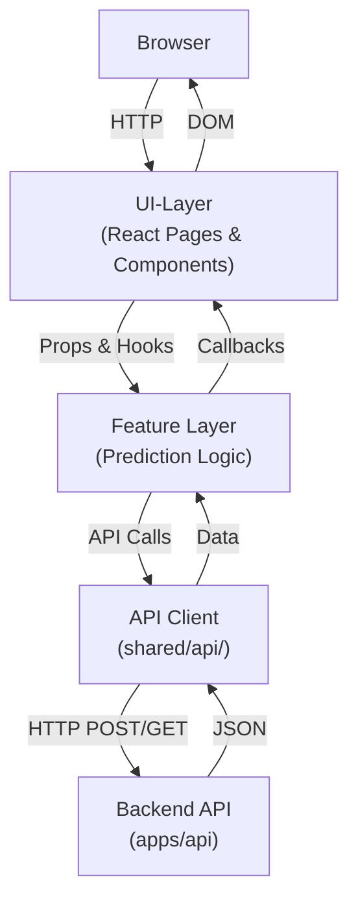

# Waldpilz Web

Das React-Frontend für die Waldpilz-Erkennung auf Resthölzern. Eine moderne, auf Vite aufgebaute Single-Page-Application mit TypeScript und komponenten-basierter Architektur.

## Aktueller Stand

- React-App mit Vite als Build-Tool
- TypeScript für Typsicherheit
- Zentralisiertes Routing mit definierten Seiten
- Wiederverwendbare UI-Komponenten-Bibliothek (Shadcn)
- Drei Hauptrouten: Startseite, Prognose-Seite und 404-Fallback
- Umgebungsunabhängige API-Integration

---

## Voraussetzungen

- **Node.js 22** – Die Web-App ist für Node.js 22 entwickelt
- **pnpm** – Moderner Paketmanager für Node.js

Optional für Entwicklung:

- **VS Code** mit den Extensions `vue.volar` und `esbenp.prettier-vscode`

---

## Installation

Im Verzeichnis `apps/web/` ausführen:

```bash
pnpm install
```

---

## Lokale Entwicklung

Dev-Server mit Vite starten:

```bash
pnpm dev
```

Die App ist anschließend in der Regel erreichbar unter:

```text
http://localhost:5173
```

Danach öffnet sich die Startseite. Die App wird beim Bearbeiten von Dateien automatisch neu geladen (Hot Module Reload).

---

## Qualitätssicherung

Linting ausführen (ESLint):

```bash
pnpm lint
```

Tests ausführen (Vitest):

```bash
pnpm test
```

Tests im Watch-Modus ausführen (automatische Neuladen bei Änderungen):

```bash
pnpm test:watch
```

Linting und Tests zusammen ausführen:

```bash
pnpm check
```

Dev-Server nur nach erfolgreichem Check starten:

```bash
pnpm dev
```

<<<<<<< HEAD
=======
### Test-Abdeckung

Die Anwendung hat eine umfassende Test-Suite:

- **Routing-Tests** (`src/test/app.test.tsx`) – Überprüfung der App-Routen
- **Seiten-Tests** (`src/test/pages/HomePage.test.tsx`) – UI-Tests der Startseite
- **Upload-Tests** (`src/test/features/prediction/upload/UploadForm.test.tsx`) – Validierung und Interaktionen des Upload-Formulars
- **Health-Check-Tests** (`src/test/features/health/HealthCheck.test.tsx`) – API-Health-Status und Zustandsübergänge
- **UI-Komponenten-Tests** (`src/test/ui/UIComponents.test.tsx`) – Zentrale UI-Bereiche und interaktive Elemente

**Aktuelle Test-Summe: 25+ Tests mit hoher Abdeckung der kritischen User-Flows**

>>>>>>> 291ab8f30fa2e49948b9033c74a728571675fbb9
---

## Verfügbare Routen

- `/` – **Startseite** (HomePage) – Übersicht und Willkommensscreen
- `/prediction` – **Prognose-Seite** (PredictionPage) – Schnittstelle für Bilderkennung
- `*` – **Not-Found-Seite** (NotFoundPage) – Fallback für unbekannte Routen

---

## Projektstruktur

```text
src/
├─ main.tsx                    # Einstiegspunkt: React-App mounted hier ins DOM
├─ app/
│  ├─ index.tsx               # App-Komponente: Root-Layout und Provider
│  ├─ layout.tsx              # Globales Layout-Wrapper
│  ├─ globals.css             # Globale CSS-Stile
│  └─ router/
│     └─ index.tsx            # Zentrale Routing-Defintion (React Router)
├─ pages/
│  ├─ HomePage.tsx            # Startseite-Komponente
│  ├─ PredictionPage.tsx      # Prognose-Seite-Komponente
│  └─ NotFoundPage.tsx        # 404-Fallback-Komponente
├─ components/
│  ├─ theme-provider.tsx      # Theme/Dark-Mode-Provider
│  ├─ ui/                     # Wiederverwendbare UI-Komponenten (Shadcn-Library)
│  │  ├─ button.tsx
│  │  ├─ card.tsx
│  │  ├─ input.tsx
│  │  ├─ form.tsx
│  │  ├─ dialog.tsx
│  │  └─ ... (weitere komponenten)
│  └─ waldpilz/               # Domain-spezifische Komponenten
│     └─ ... (Waldpilz-Features)
├─ features/
│  └─ prediction/             # Zusammenhängende Prediction-Logik
│     └─ ... (Feature-Komponenten)
├─ hooks/
│  ├─ use-mobile.ts           # Hook: Mobilitätserkennung
│  └─ use-toast.ts            # Hook: Toast-Benachrichtigungen
├─ lib/
│  └─ utils.ts                # Utility-Funktionen (z. B. classname-Helfer)
├─ shared/
│  └─ api/                    # API-Client und Kommunikation mit Backend
├─ styles/
│  └─ globals.css             # Zusätzliche globale Stile
└─ test/
<<<<<<< HEAD
   ├─ app.test.tsx            # Integrationstests für App-Komponente
   └─ setup.ts                # Vitest-Konfiguration und Setup
```

---

## Ordnerstruktur im Detail

### `src/app/`
Enthält die Anwendungs-Root-Komponente und globale Einstellungen:
- **index.tsx** – App-Komponente, lädt Provider (Theme, Router, etc.)
- **layout.tsx** – Globales Layout-Wrapper für alle Seiten
- **router/index.tsx** – Zentrale Routing-Definition mit allen verfügbaren Routen
- **globals.css** – Globale CSS-Stile (Fonts, Basis-Resets, etc.)

### `src/pages/`
Seiten-Komponenten, jede repräsentiert eine Route:
- **HomePage.tsx** – Startseite unter `/`
- **PredictionPage.tsx** – Prognose-Seite unter `/prediction`
- **NotFoundPage.tsx** – 404-Seite für unbekannte Routen

### `src/components/`
Wiederverwendbare Komponenten:
- **ui/** – Shadcn UI Komponenten (Button, Card, Input, Form, Dialog, etc.)
- **waldpilz/** – Domain-spezifische Komponenten für Waldpilz-Features
- **theme-provider.tsx** – Provider für Theme/Dark-Mode-Unterstützung

### `src/features/`
Feature-basierte Organizierung zusammenhängender Logik:
- **prediction/** – Alle Komponenten, Hooks und Logik bezüglich Bilderkennung

### `src/hooks/`
Wiederverwendbare React Custom Hooks:
- **use-mobile.ts** – Erkennung, ob App auf mobiler Geräte läuft
- **use-toast.ts** – Toast-Benachrichtigungen anzeigen

### `src/lib/`
Utility-Funktionen und Helfer:
- **utils.ts** – Klassennamen-Merger (cn), String-Manipulatoren, etc.

### `src/shared/`
Geteilter Code, der app-übergreifend verwendet wird:
- **api/** – API-Client für Kommunikation mit dem Backend (z. B. `/api/v1/predict`)

### `src/styles/`
Zusätzliche Stylesheets:
- **globals.css** – Ergänzende globale Stile

### `src/test/`
Test-Dateien:
- **app.test.tsx** – Integrationstests für die App-Komponente
- **setup.ts** – Vitest-Setup und Test-Utilities

---

## Architektur-Ansatz

Die Web-App folgt folgendem Ansatz:



---

## Entwicklungs-Workflow

### 1. Neue Seite hinzufügen

1. Komponente unter `src/pages/NewPage.tsx` erstellen
2. Route in `src/app/router/index.tsx` definieren
3. Falls Komponenten geteilt werden → unter `src/components/` ablegen

### 2. Neue Komponente hinzufügen

- **UI-Komponente** → `src/components/ui/ComponentName.tsx`
- **Domain-Komponente** → `src/components/waldpilz/ComponentName.tsx`
- **Feature-Logik** → `src/features/featureName/ComponentName.tsx`

### 3. Mit dem Backend kommunizieren

- API-Calls über `src/shared/api/` durchführen
- Backend unter `http://localhost:5173` erwartet (konfigurierbar via `.env`)
- Beispiel: `POST /api/v1/predict` für Bilderkennung

### 4. Styles anpassen

- Shadcn-Komponenten: `src/components/ui/...`
- Global Styles: `src/styles/globals.css`
- TypeScript unterstützt Tailwind CSS Klassen via `cn()` Utility

---

## Nächste Schritte

Die Prediction-Seite wird fachlich erweitert um:
- **Bild-Upload** – Datei-Input mit Validierung
- **Backend-Integration** – Bilder an `/api/v1/predict` senden
- **Ergebnisanzeige** – Erkannte Pilzarten und Vertrauenswerte anzeigen
- **Error-Handling** – Nutzer-freundliche Fehlermeldungen bei API-Fehlern
- **Loading-States** – Visuelles Feedback während der Verarbeitung

## wichtiger Hinweis
### CORS-Konfiguration für Frontend

Damit das Frontend (Standard: http://localhost:5173) mit dem Backend kommunizieren kann, muss CORS korrekt gesetzt sein.

Dazu in `apps/api/.env` folgende Variable ergänzen:

CORS_ALLOW_ORIGINS=http://localhost:5173,http://127.0.0.1:5173

Falls die `.env` noch nicht existiert:

Copy-Item .env.example .env

Ohne diese Einstellung schlägt die Anfrage vom Frontend mit "Failed to fetch" fehl.

=======
   ├─ app.test.tsx            # Integrationstests für App-Routing
   ├─ setup.ts                # Vitest-Konfiguration und Setup
   ├─ pages/
   │  └─ HomePage.test.tsx    # UI-Tests für Startseite
   ├─ features/
   │  ├─ prediction/
   │  │  └─ upload/
   │  │     └─ UploadForm.test.tsx  # Upload-Validierung und Dateihandling
   │  └─ health/
   │     └─ HealthCheck.test.tsx    # Health-Check API und Zustandstests
   └─ ui/
      └─ UIComponents.test.tsx      # Zentrale UI-Komponenten und Bereiche
```

---

## Ordnerstruktur im Detail

### `src/app/`
Enthält die Anwendungs-Root-Komponente und globale Einstellungen:
- **index.tsx** – App-Komponente, lädt Provider (Theme, Router, etc.)
- **layout.tsx** – Globales Layout-Wrapper für alle Seiten
- **router/index.tsx** – Zentrale Routing-Definition mit allen verfügbaren Routen
- **globals.css** – Globale CSS-Stile (Fonts, Basis-Resets, etc.)

### `src/pages/`
Seiten-Komponenten, jede repräsentiert eine Route:
- **HomePage.tsx** – Startseite unter `/`
- **PredictionPage.tsx** – Prognose-Seite unter `/prediction`
- **NotFoundPage.tsx** – 404-Seite für unbekannte Routen

### `src/components/`
Wiederverwendbare Komponenten:
- **ui/** – Shadcn UI Komponenten (Button, Card, Input, Form, Dialog, etc.)
- **waldpilz/** – Domain-spezifische Komponenten für Waldpilz-Features
- **theme-provider.tsx** – Provider für Theme/Dark-Mode-Unterstützung

### `src/features/`
Feature-basierte Organizierung zusammenhängender Logik:
- **prediction/** – Alle Komponenten, Hooks und Logik bezüglich Bilderkennung

### `src/hooks/`
Wiederverwendbare React Custom Hooks:
- **use-mobile.ts** – Erkennung, ob App auf mobiler Geräte läuft
- **use-toast.ts** – Toast-Benachrichtigungen anzeigen

### `src/lib/`
Utility-Funktionen und Helfer:
- **utils.ts** – Klassennamen-Merger (cn), String-Manipulatoren, etc.

### `src/shared/`
Geteilter Code, der app-übergreifend verwendet wird:
- **api/** – API-Client für Kommunikation mit dem Backend (z. B. `/api/v1/predict`)

### `src/styles/`
Zusätzliche Stylesheets:
- **globals.css** – Ergänzende globale Stile

### `src/test/`
Test-Dateien mit strukturierter Organisierung:
- **app.test.tsx** – Routing-Integrationstests
- **pages/HomePage.test.tsx** – UI-Tests der Startseite (Titel, Buttons, Inhalte)
- **features/prediction/upload/UploadForm.test.tsx** – Upload-Funktionalität (Dateivalidierung, Formate)
- **features/health/HealthCheck.test.tsx** – Health-Check Button und API-Zustände
- **ui/UIComponents.test.tsx** – Zentrale UI-Bereiche (Header, Footer, Navigation, Status-Meldungen)
- **setup.ts** – Vitest-Setup und globale Test-Utilities

---

## Test-Struktur im Detail

Die Tests folgen einem klaren Muster und decken folgende Bereiche ab:

### Routing-Tests
- **app.test.tsx** – Überprüfung aller Routen und deren Inhalte
  - Startseite wird unter `/` korrekt gerendert
  - Prediction-Seite wird unter `/prediction` angezeigt
  - 404-Seite wird bei unbekannten Routen angezeigt

### Seiten-Tests
- **HomePage.test.tsx** – UI-Elemente der Startseite
  - Projekttitel und Überschrift
  - Buttons für Aktionen
  - Inhalts-Sections und Informationsbereiche

### Feature-Tests
- **UploadForm.test.tsx** – Upload-Workflow
  - Dateiauswahl (JPG, PNG)
  - Validierung ungültiger Formate
  - Button-Interaktionen
  
- **HealthCheck.test.tsx** – Health-Status API
  - Button-Rendering
  - Lade-, Erfolgs- und Fehlerzustände
  - Callbacks bei Status-Änderungen

### UI-Komponenten-Tests
- **UIComponents.test.tsx** – Zentrale UI-Elemente
  - Layout-Struktur (Header, Main, Footer)
  - Interaktive Elemente (Buttons, Links)
  - Status-Meldungen und Benachrichtigungen
  - Accessibility und semantisches HTML

---

## Architektur-Ansatz

Die Web-App folgt folgendem Ansatz:


---

## Entwicklungs-Workflow

### 1. Neue Seite hinzufügen

1. Komponente unter `src/pages/NewPage.tsx` erstellen
2. Route in `src/app/router/index.tsx` definieren
3. Falls Komponenten geteilt werden → unter `src/components/` ablegen

### 2. Neue Komponente hinzufügen

- **UI-Komponente** → `src/components/ui/ComponentName.tsx`
- **Domain-Komponente** → `src/components/waldpilz/ComponentName.tsx`
- **Feature-Logik** → `src/features/featureName/ComponentName.tsx`

### 3. Mit dem Backend kommunizieren

- API-Calls über `src/shared/api/` durchführen
- Backend unter `http://localhost:5173` erwartet (konfigurierbar via `.env`)
- Beispiel: `POST /api/v1/predict` für Bilderkennung

### 4. Styles anpassen

- Shadcn-Komponenten: `src/components/ui/...`
- Global Styles: `src/styles/globals.css`
- TypeScript unterstützt Tailwind CSS Klassen via `cn()` Utility

---

## Nächste Schritte

Die Prediction-Seite wird fachlich erweitert um:
- **Bild-Upload** – Datei-Input mit Validierung
- **Backend-Integration** – Bilder an `/api/v1/predict` senden
- **Ergebnisanzeige** – Erkannte Pilzarten und Vertrauenswerte anzeigen
- **Error-Handling** – Nutzer-freundliche Fehlermeldungen bei API-Fehlern
- **Loading-States** – Visuelles Feedback während der Verarbeitung
>>>>>>> 291ab8f30fa2e49948b9033c74a728571675fbb9
