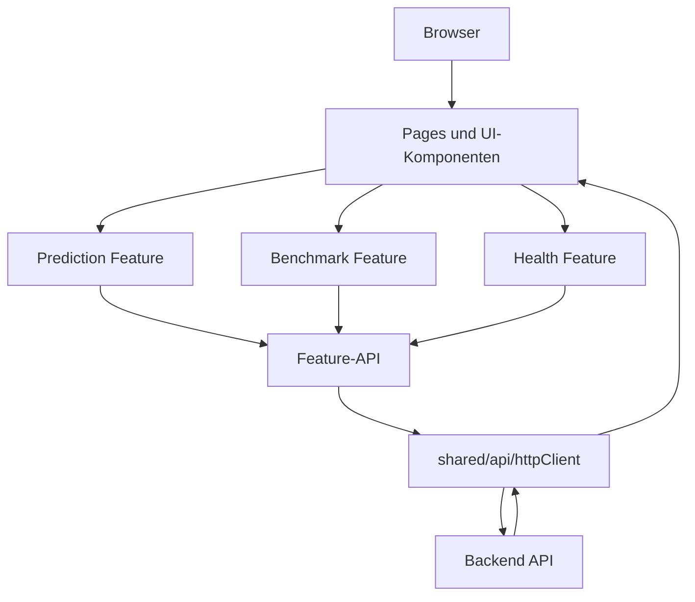

# Waldpilz Web

## Zweck des Frontends

Das Frontend unter `apps/web/` ist die Browser-Oberfläche der Waldpilz-Anwendung.
Es stellt drei zentrale Nutzerflüsse bereit:

- Einstieg über die **Startseite**
- Analyse einzelner Bilder über die **Prediction-Seite**
- Modellbewertung über die **Benchmark-Seite**

Zusätzlich kann der Nutzer über den Header einen **Health Check** gegen die API
auslösen.

---

## Technologie-Stack

Das Frontend basiert auf:

- React 19
- Vite 8
- TypeScript
- React Router
- Vitest
- ESLint
- `jspdf` und `jspdf-autotable` für den Benchmark-PDF-Export

Die Anwendung ist als Single-Page-Application aufgebaut und in Feature-Bereiche
gegliedert.

---

## Voraussetzungen

Für die lokale Frontend-Entwicklung benötigst du:

- Node.js 22
- `pnpm`

Optional, aber sehr empfehlenswert:

- VS Code
- `dbaeumer.vscode-eslint`
- `esbenp.prettier-vscode`
- `ms-azuretools.vscode-containers`

---

## Verzeichnisstruktur verstehen

Die wichtigsten Bereiche unter `apps/web/src/`:

```text
src/
├─ app/                      # App-Einstieg und Router
├─ pages/                    # Seitenkomposition
├─ components/waldpilz/      # domänenspezifische UI-Bausteine
├─ features/
│  ├─ prediction/            # Prediction-Logik
│  ├─ benchmark/             # Benchmark-Logik und Report-Export
│  └─ health/                # Health-Check-API
├─ shared/                   # gemeinsame Infrastruktur
├─ styles/                   # globale Styles
└─ test/                     # Tests
```

### Wichtige Ordner im Detail

- `src/app/`
  - App-Einstieg und Router-Konfiguration
- `src/pages/`
  - `HomePage`
  - `PredictionPage`
  - `BenchmarkPage`
  - `NotFoundPage`
- `src/components/waldpilz/`
  - wiederverwendbare UI-Bausteine der Waldpilz-Oberfläche
- `src/features/prediction/`
  - API-Zugriff, Hooks, Modelle und Ergebnis-Komponenten für Prediction
- `src/features/benchmark/`
  - Upload-Formulare, Ergebnisdarstellung und PDF-Report-Export
- `src/features/health/`
  - API-Aufruf für den Health Check
- `src/shared/api/`
  - gemeinsamer HTTP-Client
- `src/shared/config/`
  - Zugriff auf Frontend-Konfiguration wie `VITE_API_BASE_URL`

---

## Installation

Im Verzeichnis `apps/web/`:

```bash
pnpm install
```

Wenn du aus dem Repository-Root arbeitest, kannst du alternativ auch das
Root-Kommando verwenden:

```bash
make frontend
```

Das Root-Kommando übernimmt zusätzlich den lokalen Build und startet danach die
Preview.

---

## Frontend-Konfiguration

Das Frontend liest seine Backend-Basis-URL über `VITE_API_BASE_URL`.

### `.env` anlegen

```bash
cp .env.example .env
```

### Standardinhalt

```env
VITE_API_BASE_URL=http://127.0.0.1:8000/api/v1
```

### Wichtige Hinweise zur Konfiguration

- Nur Variablen mit Präfix `VITE_` stehen im Frontend zur Verfügung.
- Diese Variablen werden beim Build in das Frontend eingebettet.
- Wenn sich `VITE_API_BASE_URL` ändert, muss das Frontend neu gebaut werden.
- Im Docker-Deployment verwendet das Frontend standardmäßig `/api/v1`.

---

## Lokal entwickeln

### Variante A: Nur den Frontend-Dev-Server starten

Im Verzeichnis `apps/web/`:

```bash
pnpm dev
```

Die Anwendung läuft dann unter:

```text
http://localhost:5173
```

Diese Variante ist für schnelle UI-Arbeit am angenehmsten.

### Variante B: Frontend über das Root-`Makefile` starten

Aus dem Repository-Root:

```bash
make frontend
```

Dabei wird ein produktionsnaher lokaler Build erzeugt und anschließend die
Preview gestartet.

Die Preview ist dann unter folgendem Port erreichbar:

```text
http://127.0.0.1:4173
```

### Voraussetzung für beide Varianten

Wenn das Backend lokal separat läuft, muss es CORS für diese Origins erlauben:

- `http://localhost:5173`
- `http://127.0.0.1:5173`

Die Backend-`.env.example` ist dafür bereits vorbereitet.

---

## Qualitätssicherung

### Linting

```bash
pnpm lint
```

### Tests

```bash
pnpm test
```

### TypeScript-Prüfung

```bash
pnpm exec tsc --noEmit
```

### Produktions-Build

```bash
pnpm build
```

### Gebauten Stand lokal prüfen

```bash
pnpm start
```

Die Preview läuft dann unter:

```text
http://localhost:4173
```

---

## Routen und Nutzerfluss

### `/`

Die Startseite dient als Einstiegspunkt in die Anwendung.

Ziele der Seite:

- das Projekt kurz erklären
- den Nutzer in die Bildanalyse führen
- das visuelle Waldpilz-Design transportieren

### `/prediction`

Die Prediction-Seite ist für die Analyse einzelner Bilder zuständig.

Der Nutzerfluss:

1. Bild auswählen oder hochladen
2. Bildvorschau prüfen
3. Analyse starten
4. Ergebnis mit Bounding Boxes und Kennzahlen ansehen

Das Frontend ruft dafür den Endpunkt `POST /api/v1/predict` auf.

### `/benchmark`

Die Benchmark-Seite ist für die Bewertung des Modells gegen einen annotierten
Datensatz zuständig.

Der Nutzerfluss:

1. ZIP mit Testbildern hochladen
2. ZIP mit Labels hochladen
3. Benchmark starten
4. Kennzahlen und Detailansicht prüfen
5. PDF-Report herunterladen

Das Frontend ruft dafür den Endpunkt `POST /api/v1/benchmark` auf.

### `*`

Fallback für unbekannte Routen.

---

## Benchmark im Frontend verstehen

Die Benchmark-Seite ist ein zentraler Teil des Projekts und sollte von neuen
Entwicklern besonders gut verstanden werden.

### Welche Dateien erwartet das Frontend?

Der Benchmark benötigt zwei ZIP-Dateien:

1. `test_archive`
2. `label_archive`

#### `test_archive`

- ZIP-Datei mit den Testbildern
- unterstützte Bildtypen: JPG, JPEG und PNG
- die Bilder dürfen im Wurzelverzeichnis oder in Unterordnern liegen

#### `label_archive`

- ZIP-Datei mit den Ground-Truth-Annotationen im YOLO-Format
- pro Bild eine `.txt`-Datei
- der Dateiname muss exakt zum Bild passen

### Wichtiges Matching-Prinzip

Das Zuordnen erfolgt über den Dateinamen.

Beispiele:

- `bild_001.jpg` gehört zu `bild_001.txt`
- `bild_002.png` gehört zu `bild_002.txt`

Dieses Matching ist einer der häufigsten Fehlerfälle. Wenn die Dateinamen nicht
zusammenpassen, kann das Backend die Paare nicht korrekt auswerten.

### Erwartete ZIP-Struktur

```text
testbilder.zip
├─ bild_001.jpg
├─ bild_002.jpg
└─ bild_003.png

labels.zip
├─ bild_001.txt
├─ bild_002.txt
└─ bild_003.txt
```

### YOLO-Label-Format

Jede Zeile einer Label-Datei hat dieses Format:

```text
<class_id> <x_center> <y_center> <width> <height>
```

Beispiel:

```text
0 0.5 0.5 0.4 0.4
```

Die Koordinaten sind normalisiert, also typischerweise Werte zwischen `0.0` und
`1.0`.

### Welche Ergebnisse zeigt das Frontend an?

Nach einem erfolgreichen Benchmark zeigt die UI unter anderem:

- Precision
- Recall
- F1-Score
- Accuracy
- mAP
- mean IoU
- Kennzahlen pro Label
- Detailansicht pro Bild
- Fehlerfälle einzelner Bilder

### Benchmark-Report

Aus dem Benchmark-Ergebnis erzeugt das Frontend zusätzlich einen PDF-Report.

Der Report enthält aktuell:

- Waldpilz-Branding
- Benchmark-Metadaten
- Kennzahlen
- grafische Auswertung
- Detailtabelle pro Bild

Der Export liegt im Code unter:

- `src/features/benchmark/utils/reportExport.ts`

---

## Lokaler Testablauf für den Benchmark

Wenn du die Benchmark-Funktion manuell prüfen möchtest:

1. Backend lokal starten.
2. Frontend lokal starten.
3. Browser öffnen.
4. `http://localhost:5173/benchmark` aufrufen.
5. ZIP mit Testbildern hochladen.
6. ZIP mit Labels hochladen.
7. Benchmark starten.
8. Kennzahlen und Detailansicht prüfen.
9. PDF-Report exportieren.

Der Backend-Endpunkt muss unter der konfigurierten `VITE_API_BASE_URL`
erreichbar sein und `POST /benchmark` bereitstellen.

---

## Architektur des Frontends

Die Web-Anwendung trennt Seitenkomposition, Feature-Logik und gemeinsame
Infrastruktur.



### Warum diese Struktur sinnvoll ist

- Seiten bleiben übersichtlich.
- Fachlogik ist nicht in beliebigen Komponenten verstreut.
- Prediction und Benchmark können unabhängig weiterentwickelt werden.
- Tests lassen sich näher an der jeweiligen Funktionalität ablegen.

---

## Docker: Frontend allein bauen und starten

Wenn nur das Frontend-Image gebaut werden soll:

### Image bauen

```bash
pnpm docker:build
```

### Container starten

```bash
pnpm docker:run
```

### Container stoppen

```bash
pnpm docker:stop
```

### Standardwerte

- Image: `waldpilz-web`
- Container: `waldpilz-web`
- Host-Port: `8080`
- Container-Port: `80`

### API-Basis-URL beim Build überschreiben

```bash
docker build \
  --build-arg VITE_API_BASE_URL=http://127.0.0.1:8000/api/v1 \
  -t waldpilz-web .
```

---

## Gemeinsames Deployment mit dem Backend

Für den normalen Betrieb wird die Anwendung aus dem Repository-Root gemeinsam
gestartet:

```bash
make deploy
```

Danach ist die Anwendung standardmäßig erreichbar unter:

```text
http://127.0.0.1:8080
```

### Was im gemeinsamen Deployment gilt

- das Frontend wird per Nginx ausgeliefert
- Nginx proxyt `/api/v1`, `/docs`, `/redoc` und `/openapi.json` an das Backend
- Frontend und Backend kommunizieren intern über Docker
- das Frontend verwendet dabei dieselbe Origin und die Basis-URL `/api/v1`

### Wichtige Betriebsbefehle

- `make deploy`
- `make ps`
- `make logs`
- `make health`
- `make down`
- `make clean`

### Hinweis für Windows

Wenn du auf Windows arbeitest, führe diese `make`-Kommandos über **Git Bash**
aus, weil die zugrunde liegenden Deploy-Skripte POSIX-Shell-Skripte sind.
