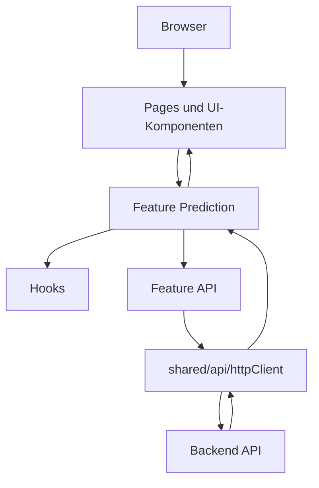

# Waldpilz Web

Das React-Frontend für die Waldpilz-Erkennung auf Resthölzern. Die Anwendung
ist eine Vite-basierte Single-Page-Application mit TypeScript, React Router und
einer feature-orientierten Struktur für Upload, Prediction-Flow und
Ergebnisdarstellung.

## Überblick

- React 19 mit Vite 8
- TypeScript für die UI- und API-Typisierung
- React Router für die Seitenstruktur
- Feature-Modul für Prediction mit API, Hook, Model und Komponenten
- Gemeinsame Docker-Bereitstellung mit dem Backend über das Root-`Makefile`

## Voraussetzungen

- Node.js 22
- `pnpm`
- optional Docker für Container-Build und Deployment

Optional für Entwicklung:

- VS Code mit `dbaeumer.vscode-eslint`
- VS Code mit `esbenp.prettier-vscode`
- VS Code mit `ms-azuretools.vscode-containers`

## Installation

Im Verzeichnis `apps/web/`:

```bash
pnpm install
```

## Konfiguration

Die API-Basis-URL wird über `VITE_API_BASE_URL` gesetzt.

```bash
cp .env.example .env
```

Standardwert:

```env
VITE_API_BASE_URL=http://127.0.0.1:8000/api/v1
```

Hinweis:

- `VITE_*`-Variablen werden beim Build in das Frontend eingebettet
- bei Änderungen an `VITE_API_BASE_URL` muss das Frontend neu gebaut werden
- im gemeinsamen Docker-Deployment wird stattdessen `/api/v1` verwendet

## Lokal entwickeln

Dev-Server starten:

```bash
pnpm dev
```

Die App läuft danach unter:

```text
http://localhost:5173
```

Wenn das Backend lokal separat läuft, sollte dort CORS für
`http://localhost:5173` und `http://127.0.0.1:5173` erlaubt sein.

## Qualitätssicherung

Linting:

```bash
pnpm lint
```

Tests:

```bash
pnpm test
```

TypeScript-Prüfung:

```bash
pnpm exec tsc --noEmit
```

Produktions-Build:

```bash
pnpm build
```

Gebauten Stand lokal prüfen:

```bash
pnpm start
```

Die Preview läuft dann unter `http://localhost:4173`.

## Routen

- `/` – Startseite
- `/prediction` – Bilderkennung mit Upload, Analyse und Ergebnisdarstellung
- `*` – 404-Fallback

## Architektur

Die Web-App trennt Seitenkomposition, Feature-Logik und gemeinsame
Infrastruktur:



Wichtige Bereiche:

- `src/pages/` für Seiten wie `HomePage` und `PredictionPage`
- `src/components/waldpilz/` für domänenspezifische UI-Bausteine
- `src/features/prediction/` für Prediction-spezifische API-, Hook-, Modell- und UI-Logik
- `src/features/health/` für den Health-Check-Flow
- `src/shared/api/` und `src/shared/config/` für geteilte Infrastruktur wie HTTP-Client und Env-Zugriff
- `src/test/` für Routing-, Seiten-, Feature- und UI-Tests

## Docker für das Frontend allein

Image bauen:

```bash
pnpm docker:build
```

Container starten:

```bash
pnpm docker:run
```

Container stoppen:

```bash
pnpm docker:stop
```

Standardwerte:

- Image: `waldpilz-web`
- Container: `waldpilz-web`
- Host-Port: `8080`
- Container-Port: `80`

Wenn das Frontend allein gebaut wird, kann die API-Basis-URL beim Build
überschrieben werden:

```bash
docker build \
  --build-arg VITE_API_BASE_URL=http://127.0.0.1:8000/api/v1 \
  -t waldpilz-web .
```

## Gemeinsames Deployment mit Backend

Für den normalen Betrieb sollte die Anwendung aus dem Repository-Root gemeinsam
gestartet werden:

```bash
make deploy
```

Danach ist die Anwendung standardmäßig unter `http://localhost:8080`
erreichbar.

Wichtige Befehle:

- `make deploy` – baut und startet Frontend und Backend gemeinsam
- `make ps` – zeigt Container-Status und Healthchecks
- `make logs` – zeigt Logs beider Dienste
- `make health` – prüft `GET /api/v1/health`
- `make down` – stoppt den Stack
- `make clean` – stoppt den Stack und entfernt Volumes

Im gemeinsamen Deployment gilt:

- das Frontend wird per Nginx ausgeliefert
- Nginx proxyt `/api/v1`, `/docs`, `/redoc` und `/openapi.json` an das Backend
- die Kommunikation zwischen Frontend und Backend läuft intern über Docker
- das Frontend nutzt dafür dieselbe Origin mit der Basis-URL `/api/v1`
